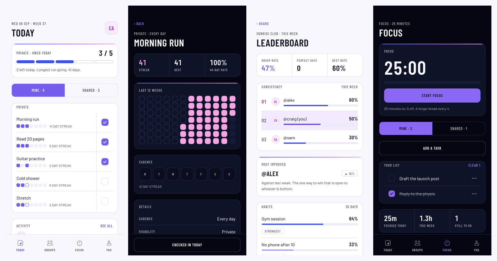
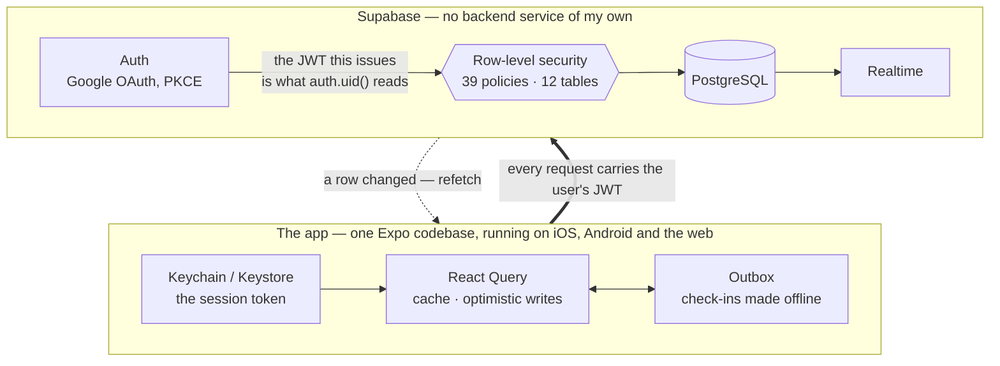
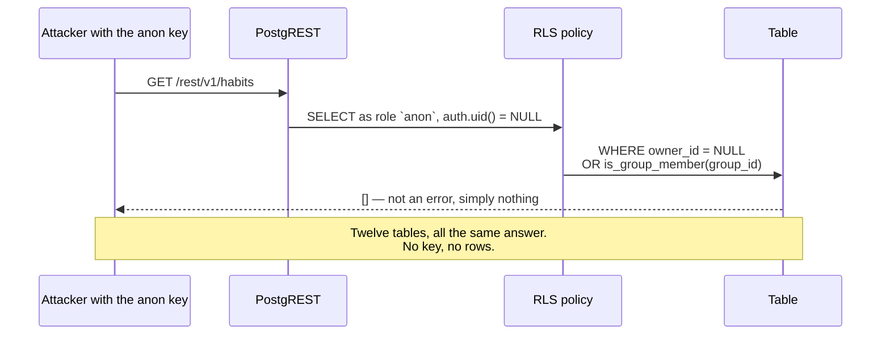
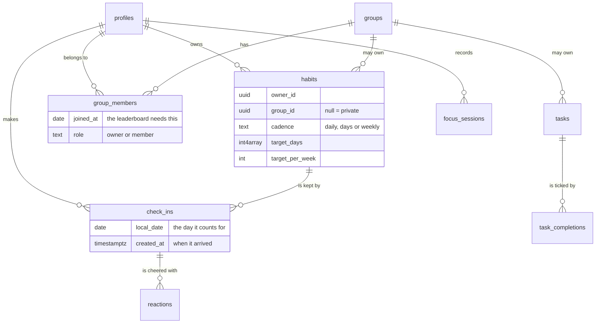
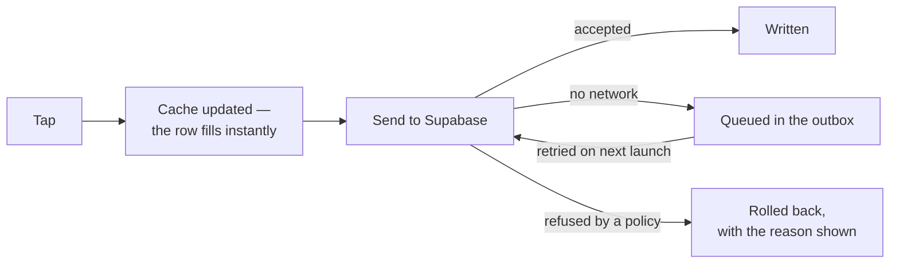
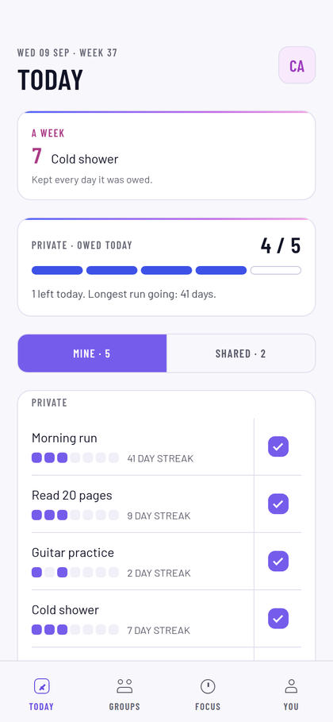
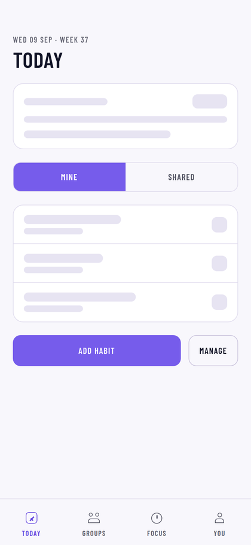

<div align="center">


# StreakMates

**Better together.**

A habit tracker built around the people you're doing it with.

[**Try it →** streak-mates.vercel.app](https://streak-mates.vercel.app)

`React Native` · `Expo` · `TypeScript` · `Supabase` · `PostgreSQL`

</div>



---

## The problem

Most habit trackers are solitary. You tick a box, a number goes up, and nobody
else ever knows. It works right up until the novelty of the number wears off,
and then there is nothing else holding the habit up.

What tends to keep people going is somebody noticing. Not a leaderboard of
strangers, and not a social feed: three or four friends who can see that you
said you'd run this week and haven't yet.

**StreakMates makes that the primary object.** A habit can be private, or it can
belong to a group — and a shared habit is the same first-class thing as a
private one, not a private habit with sharing bolted on top. Everything else in
the app follows from that decision, including most of the hard parts:

| Because habits can be shared… | …this had to be solved |
| --- | --- |
| other people's data is on your screen | every read is authorised in the database, not the client |
| people join a group midway through | the leaderboard has to not punish them for it |
| two people tick the same shared task | "one of us does it" vs "each of us does it" are different things |
| a group owner can delete shared history | destructive permissions differ from read permissions |

---

## What it does

- **Private and shared habits** — daily, specific weekdays, or *n* times a week
- **Groups** joined by a six-character invite code, rate-limited against guessing
- **A live board** showing who kept what this week, updating over Realtime
- **A leaderboard** that measures consistency, not volume — see [below](#the-leaderboard-had-to-be-fair)
- **A focus timer** with shared task lists
- **Streaks, heatmaps and milestones**, with a colour that changes as a run grows
- **Works offline** — check-ins queue and replay when you're back
- **Runs on iOS, Android and the web** from one codebase

---

## How it works

There is no backend service of my own. **The database is the API**, and Postgres
row-level security is the authorisation layer — the app talks to Supabase
directly, and every request arrives carrying the user's JWT.



**Why no backend of my own.** A server in the middle would be a second place to
write the same authorisation rules, and two copies of a security rule means one
of them is out of date. Putting the rules in the database means they hold for
every client, every query, and every future surface — including a `curl` with a
stolen key.

---

## The security model

The public anon key is exactly that — public. It ships inside the app bundle,
and anyone can read it out. So the design assumption is that **an attacker has
the key and is talking straight to the database.**



Every table has RLS enabled and no table is readable without a session. A
signed-in user sees their own rows plus the rows of groups they belong to — and
that boundary is evaluated by Postgres, so no client bug can widen it.

### Two things this caught that I would not have found by reading

**RLS cannot express "this column may not change."** A policy's `USING` clause
sees the row as it *was*; `WITH CHECK` sees it as it *will be*. Neither sees
both, so "you may edit this habit, but you may not move it to a group you are
not in" is not expressible as a policy at all. A group member could have
re-parented a habit — taking its entire history with it — and every policy
would have passed. The fix is a column-level `REVOKE` plus a trigger that
compares `OLD` and `NEW`, which is the only place both exist.

**Postgres grants `EXECUTE` on new functions to `PUBLIC`.** A migration
revoking a function from `anon` therefore did *nothing*, because `anon` never
held the grant directly — it inherited it from `PUBLIC`. I only found this
because I applied the migration to a scratch database and queried
`has_function_privilege` afterwards rather than trusting that the SQL said what
I meant. Before the correction, a stranger could walk a wordlist through
`username_available` and enumerate every handle on the platform.

### The attack suite

`supabase/tests/` stands up a throwaway Postgres, applies all thirteen
migrations, and then attacks the policies from the perspective of each role:
signed-out, a group member, a non-member, the group owner.

```
25 scenarios · 122 assertions · exit 0
```

It asserts the *refusals*, not the happy paths — that a non-member's read comes
back empty, that a member cannot delete a shared habit, that a completion cannot
be edited after the fact. See [`docs/security.md`](./docs/security.md).

---

## The data model



Two columns are load-bearing in ways that aren't obvious:

- **`check_ins.local_date` is separate from `created_at`.** The day a habit
  counts for is a local calendar date; when the row arrived is an instant. Using
  one for the other breaks streaks for anyone who checks in near midnight, or
  who travels.
- **`group_members.joined_at` exists for fairness.** Without it, joining a group
  on Friday makes you look like you failed Monday to Thursday.

---

## Engineering decisions

### Check-ins work offline

Ticking a habit is the app's core action and it must never feel like it's
waiting for a network. It doesn't — it doesn't wait for one at all.



The queue is keyed by `(habit, local_date)`, so replaying it twice cannot create
two check-ins for one day, and a check-in made on a plane still counts for the
day it was made rather than the day it uploaded.

### The leaderboard had to be fair

Ranking on raw check-in count rewards whoever tracks the most habits, which is a
different thing from consistency. So every figure is `completed ÷ expected`, and
"expected" does real work:

- nothing is expected of you before you **joined the group**
- nothing is expected of a habit before it was **created**
- a **weekly** habit expects `ceil(target × days ÷ 7)`, scaled to the window
- and completions are **capped at what was owed** — doing five sessions against
  a target of three is 100%, not 167%

That last rule was a bug I found by looking at a rendered screen: a gym habit
was showing **106%** and quietly inflating the whole group's rate.

There is also a second way to win. **Most improved** compares this week against
last, because a ladder where the same person is always top is a ladder everyone
else stops looking at.

### The design system is measured, not chosen

The brand palette is light by design, which makes several of its colours
unreadable as text — orchid measures 2.98:1 on white. So each theme carries its
own variant of each meaning, and screens read `colors.meaning.social` rather
than reaching for a hex.

The contrast rules are **tests**, not comments:

```
theme: every meaning is readable as ink on every ground
theme: the ink floor of 62 clears AA
theme: the brand gradient does NOT carry text — which is why the other exists
```

That last one is a guard. The sign-in button was originally filled with the full
brand gradient, which ends in soft pink: white on it is **1.85:1**. The label was
readable at the left of the button and not at the right. No choice of ink fixes
that, because the sweep spans both ends of the lightness range — so there is a
second, darker gradient for anything with a label on it, and a test that fails
if someone "simplifies" the two back into one.

### Colour carries meaning

Blue is progress, violet is a primary action, orchid is social, pink is
celebration. The full gradient is reserved for genuine accomplishments and
appears in exactly one place in the app.

A streak's colour climbs that spectrum as it grows — blue at a day, violet at a
week, pink at a month — so the colour of a number tells you how long it has been
true.

<div align="center">


</div>

*Left: the one place the full gradient appears. Right: loading shows structure —
first-load layout shift is measured at 0px.*

---

## How it's verified

Three layers, because they catch different things.

| Layer | What it covers | Size |
| --- | --- | --- |
| **Unit tests** | streaks, dates, leaderboard maths, contrast, type scaling, offline queue | 196 assertions |
| **Attack suite** | RLS policies, from every role, on a real Postgres | 122 assertions, 25 scenarios |
| **Browser harness** | the real screens, with a fake session and mocked network | 8 screens, both themes |

The third layer earned its place. Everything behind the sign-in gate is
otherwise unreviewable without a live database and a real account, so
`scripts/preview/` puts a fake session in `localStorage`, answers Supabase from
fixtures, and drives the actual app. **Nothing is stubbed inside the app.**

Its first run found three bugs in about a minute — avatars rendering as `@(`
on the leaderboard, the 106% habit rate, and a completed day drawn as a row of
tiny rainbows. It also measures things that are cheap to assert and easy to
regress:

```bash
npm run preview:screens    # all 8 screens, both themes, console errors
npm run preview:touch      # every touch target ≥ 44×44, no horizontal overflow
npm run preview:gestures   # long-press opens the sheet — and a tap still doesn't
npm run preview:premium    # optimistic writes, skeletons, milestone, remembered tab
```

`preview:touch` found ten controls under 44×44 that looked fine on a phone,
because they carried `hitSlop` — which **react-native-web does not implement**.
Reading the source would never have shown that.

---

## Running it

```bash
npm install
cp .env.example .env        # then fill in a Supabase URL and anon key
npm start                   # Expo Go on a phone, or press w for the browser
```

Setting up the Supabase side takes about twenty minutes, once, and is walked
through in [`supabase/README.md`](./supabase/README.md) — creating the project,
running the migrations in order, and wiring up Google sign-in.

```bash
npm test                    # 196 unit tests
npm run typecheck           # tsc --noEmit
./supabase/tests/run.sh     # the attack suite (needs a local postgres)
npm run build:web           # static export
```

---

## Project structure

```
app/                  screens — expo-router, file-based
  (tabs)/             Today · Groups · Focus · You
  group/  habit/      detail and modal flows
src/
  components/         the design system — Plate, HabitRow, WeekStrip, Tick…
  lib/                pure logic: streaks, leaderboard, dates, outbox, tasks
  theme/              palette.ts and type-scale.ts (pure, tested)
                      tokens.ts — the only file that touches the platform
  auth/               session, Google OAuth, deep links
supabase/
  migrations/         13, applied in order
  tests/              the attack suite
scripts/preview/      the browser harness
docs/                 security notes, web deployment, screenshots
```

The theme is split for a reason worth stating: `tokens.ts` reads `PixelRatio`
and therefore imports react-native, which the test runner can't parse. Keeping
colour and type in pure files means the palette stays directly testable, and one
named file owns the platform dependency.

---

## What I'd do next

Being honest about the edges, since a portfolio piece with no known gaps is
usually one that hasn't been looked at:

- **Sign in with Apple** — required for App Store review alongside Google
- **Push notifications for nudges** — reminders are currently on-device only,
  which means they can't follow you to a second phone
- **A real end-to-end suite** against a disposable Supabase project; the browser
  harness mocks the network, so it proves the client and not the round trip
- **Android predictive back** — off until it can be tested on a physical device
- **Typography scale** — body sits at 15px against a platform norm nearer 17

---

<div align="center">

Built by [Craig Ataide](https://github.com/navysum) · [streak-mates.vercel.app](https://streak-mates.vercel.app)

</div>
