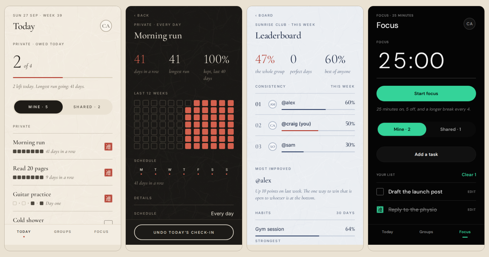
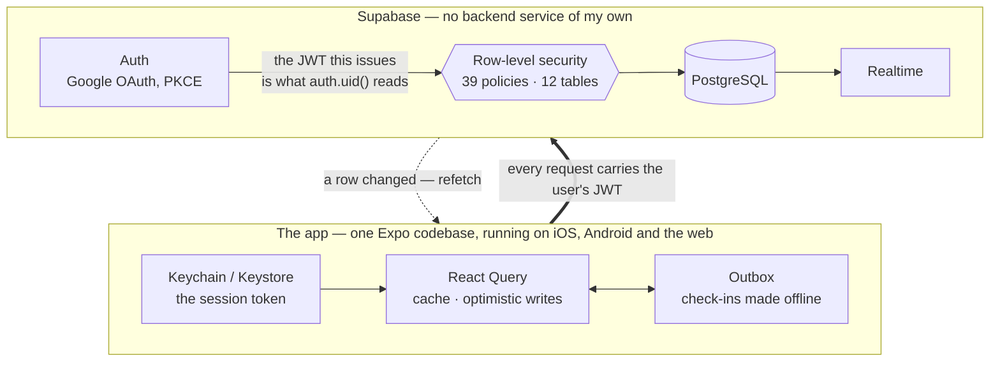
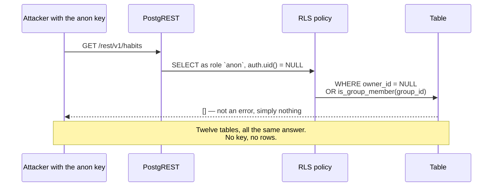
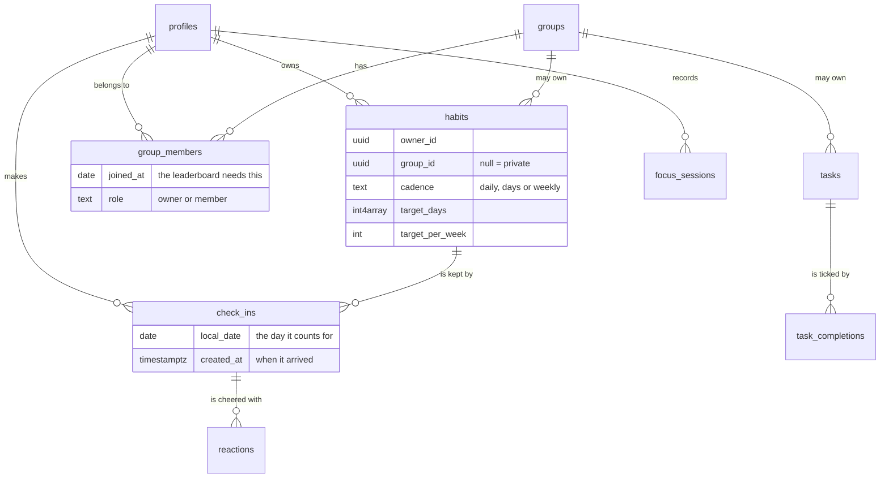
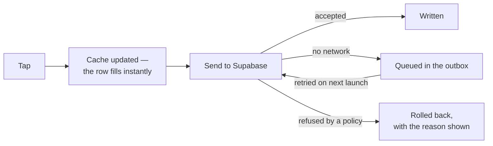
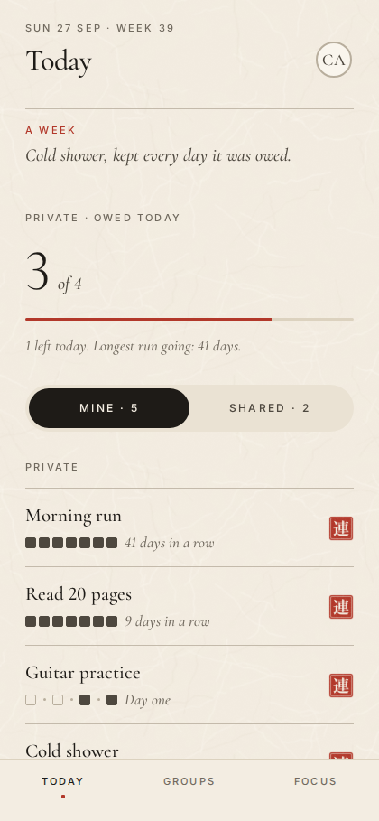
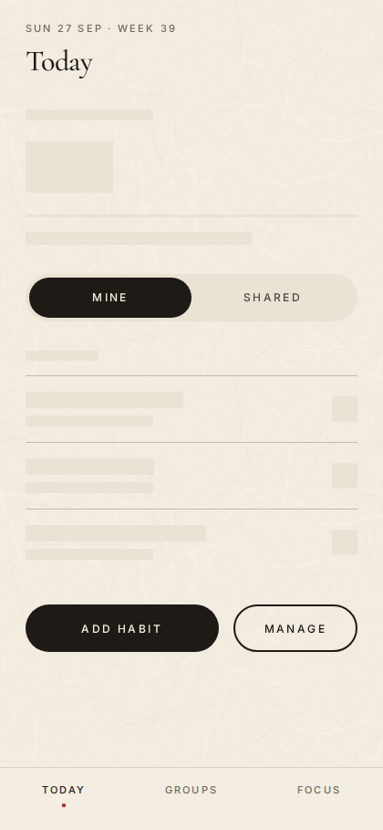

<div align="center">


# StreakMates

**Better together.**

A habit tracker built around the people you're doing it with.

[**Try it →** streak-mates.vercel.app](https://streak-mates.vercel.app)

`React Native` · `Expo` · `TypeScript` · `Supabase` · `PostgreSQL`

**Status (Sep 2026): live on the web.** The latest change moves it onto the
NavySum design system — the house style it shares with every other NavySum app.

</div>



---

## The problem

Most habit trackers are solitary. You tick a box, a number goes up, and nobody
else ever knows. It works right up until the novelty of the number wears off,
and then there is nothing else holding the habit up.

What tends to keep people going is somebody noticing. Not a leaderboard of
strangers, and not a social feed: three or four friends who can see that you
said you'd run this week and haven't yet.

**StreakMates makes that the primary object.** A habit can be private, or it can
belong to a group — and a shared habit is the same first-class thing as a
private one, not a private habit with sharing bolted on top. Everything else in
the app follows from that decision, including most of the hard parts:

| Because habits can be shared… | …this had to be solved |
| --- | --- |
| other people's data is on your screen | every read is authorised in the database, not the client |
| people join a group midway through | the leaderboard has to not punish them for it |
| two people tick the same shared task | "one of us does it" vs "each of us does it" are different things |
| a group owner can delete shared history | destructive permissions differ from read permissions |

---

## What it does

- **Private and shared habits** — daily, specific weekdays, or *n* times a week
- **Groups** joined by a six-character invite code, rate-limited against guessing
- **A live board** showing who kept what this week, updating over Realtime
- **A leaderboard** that measures consistency, not volume — see [below](#the-leaderboard-had-to-be-fair)
- **A focus timer** with shared task lists
- **Streaks, heatmaps and milestones** — each check-in stamps a seal, and a run
  that reaches a week, a month, a hundred days or a year gets one quiet line
- **Six themes** — Washi & Seal, LifeOS and Aizome, each light, dark or
  following the phone
- **Works offline** — check-ins queue and replay when you're back
- **Runs on iOS, Android and the web** from one codebase

---

## How it works

There is no backend service of my own. **The database is the API**, and Postgres
row-level security is the authorisation layer — the app talks to Supabase
directly, and every request arrives carrying the user's JWT.


```mermaid
flowchart TB
    subgraph app["The app — one Expo codebase, running on iOS, Android and the web"]
        direction LR
        rq["React Query<br/>cache · optimistic writes"]
        outbox["Outbox<br/>check-ins made offline"]
        keys["Keychain / Keystore<br/>the session token"]
        rq <--> outbox
        keys --> rq
    end

    subgraph db["Supabase — no backend service of my own"]
        direction LR
        rls{{"Row-level security<br/>39 policies · 12 tables"}}
        pg[("PostgreSQL")]
        rt["Realtime"]
        auth["Auth<br/>Google OAuth, PKCE"]
        auth -->|"the JWT this issues<br/>is what auth.uid() reads"| rls
        rls --> pg --> rt
    end

    app ==>|"every request carries the user's JWT"| db
    db -.->|"a row changed — refetch"| app
```

**Why no backend of my own.** A server in the middle would be a second place to
write the same authorisation rules, and two copies of a security rule means one
of them is out of date. Putting the rules in the database means they hold for
every client, every query, and every future surface — including a `curl` with a
stolen key.

---

## The security model

The public anon key is exactly that — public. It ships inside the app bundle,
and anyone can read it out. So the design assumption is that **an attacker has
the key and is talking straight to the database.**


```mermaid
sequenceDiagram
    participant A as Attacker with the anon key
    participant P as PostgREST
    participant R as RLS policy
    participant D as Table

    A->>P: GET /rest/v1/habits
    P->>R: SELECT as role `anon`, auth.uid() = NULL
    R->>D: WHERE owner_id = NULL<br/>OR is_group_member(group_id)
    D-->>A: [] — not an error, simply nothing
    Note over A,D: Twelve tables, all the same answer.<br/>No key, no rows.
```

Every table has RLS enabled and no table is readable without a session. A
signed-in user sees their own rows plus the rows of groups they belong to — and
that boundary is evaluated by Postgres, so no client bug can widen it.

### Two things this caught that I would not have found by reading

**RLS cannot express "this column may not change."** A policy's `USING` clause
sees the row as it *was*; `WITH CHECK` sees it as it *will be*. Neither sees
both, so "you may edit this habit, but you may not move it to a group you are
not in" is not expressible as a policy at all. A group member could have
re-parented a habit — taking its entire history with it — and every policy
would have passed. The fix is a column-level `REVOKE` plus a trigger that
compares `OLD` and `NEW`, which is the only place both exist.

**Postgres grants `EXECUTE` on new functions to `PUBLIC`.** A migration
revoking a function from `anon` therefore did *nothing*, because `anon` never
held the grant directly — it inherited it from `PUBLIC`. I only found this
because I applied the migration to a scratch database and queried
`has_function_privilege` afterwards rather than trusting that the SQL said what
I meant. Before the correction, a stranger could walk a wordlist through
`username_available` and enumerate every handle on the platform.

### The attack suite

`supabase/tests/` stands up a throwaway Postgres, applies all thirteen
migrations, and then attacks the policies from the perspective of each role:
signed-out, a group member, a non-member, the group owner.

```
25 scenarios · 122 assertions · exit 0
```

It asserts the *refusals*, not the happy paths — that a non-member's read comes
back empty, that a member cannot delete a shared habit, that a completion cannot
be edited after the fact. See [`docs/security.md`](./docs/security.md).

---

## The data model


```mermaid
erDiagram
    profiles ||--o{ habits : owns
    profiles ||--o{ check_ins : makes
    profiles ||--o{ group_members : "belongs to"
    groups   ||--o{ group_members : has
    groups   ||--o{ habits : "may own"
    groups   ||--o{ tasks : "may own"
    habits   ||--o{ check_ins : "is kept by"
    check_ins ||--o{ reactions : "is cheered with"
    tasks    ||--o{ task_completions : "is ticked by"
    profiles ||--o{ focus_sessions : records

    habits {
        uuid owner_id
        uuid group_id "null = private"
        text cadence "daily, days or weekly"
        int4array target_days
        int target_per_week
    }
    check_ins {
        date local_date "the day it counts for"
        timestamptz created_at "when it arrived"
    }
    group_members {
        date joined_at "the leaderboard needs this"
        text role "owner or member"
    }
```

Two columns are load-bearing in ways that aren't obvious:

- **`check_ins.local_date` is separate from `created_at`.** The day a habit
  counts for is a local calendar date; when the row arrived is an instant. Using
  one for the other breaks streaks for anyone who checks in near midnight, or
  who travels.
- **`group_members.joined_at` exists for fairness.** Without it, joining a group
  on Friday makes you look like you failed Monday to Thursday.

---

## Engineering decisions

### Check-ins work offline

Ticking a habit is the app's core action and it must never feel like it's
waiting for a network. It doesn't — it doesn't wait for one at all.


```mermaid
flowchart LR
    tap["Tap"] --> opt["Cache updated —<br/>the row fills instantly"]
    opt --> send["Send to Supabase"]
    send -- "accepted" --> done["Written"]
    send -- "no network" --> queue["Queued in the outbox"]
    queue -- "retried on next launch" --> send
    send -- "refused by a policy" --> undo["Rolled back,<br/>with the reason shown"]
```

The queue is keyed by `(habit, local_date)`, so replaying it twice cannot create
two check-ins for one day, and a check-in made on a plane still counts for the
day it was made rather than the day it uploaded.

### The leaderboard had to be fair

Ranking on raw check-in count rewards whoever tracks the most habits, which is a
different thing from consistency. So every figure is `completed ÷ expected`, and
"expected" does real work:

- nothing is expected of you before you **joined the group**
- nothing is expected of a habit before it was **created**
- a **weekly** habit expects `ceil(target × days ÷ 7)`, scaled to the window
- and completions are **capped at what was owed** — doing five sessions against
  a target of three is 100%, not 167%

That last rule was a bug I found by looking at a rendered screen: a gym habit
was showing **106%** and quietly inflating the whole group's rate.

There is also a second way to win. **Most improved** compares this week against
last, because a ladder where the same person is always top is a ladder everyone
else stops looking at.

### One design system, shared by every NavySum app

StreakMates is one of several NavySum apps, and they are meant to feel like one
family rather than five. So it is built on the NavySum house style, first seen
in Parables: **paper, ink and one red seal.** The kit lives in `src/theme` and
`src/components/ui.tsx` under the same names every NavySum app uses, so a
component written for one reads the same in all of them.

- **One accent.** The seal colour marks the single most important thing on a
  screen — the stamp on a completed habit, the active tab, a text button. No
  gradients, no second accent, no coloured backgrounds. On a list of habits
  the week is drawn in ink and only the stamps are red; a habit's own calendar
  is stamped in red, as a NavySum calendar is.
- **Type carries hierarchy, not boxes.** Cormorant Garamond for content, Inter
  for controls, small uppercase tracked labels above sections, hairlines
  instead of cards.
- **Completion is a stamp.** Checking a habit in brings the seal down — 1.3× to
  its own size over 260 ms, easing out, with a success haptic; under Reduce
  Motion it simply fades in. StreakMates' seal says 連: "in a row", and "a
  companion who comes along". It is drawn from the font by
  `scripts/make-icons.mjs`, which also cuts every app icon from it.
- **Three tabs, in words.** Today, Groups and Focus. You — profile, record,
  settings — moved behind your monogram in each tab's corner.
- **Six themes.** Washi & Seal, LifeOS and Aizome, each designed in light and
  dark rather than inverted, with Automatic following the phone. Each family's
  fonts load only when it is chosen.

### The palettes are measured, not trusted

The design system states that its palettes pass WCAG AA. Measured over all six
themes, three pairings it calls for do not:

| Pairing | Worst case | What the app does instead |
| --- | --- | --- |
| muted ink on a modal's deeper paper | 4.22:1, Washi | modals and sheets are drawn in a *deepened* theme that steps muted ink up to the softer ink |
| the accent on its own wash — a selected chip | 4.00:1, Aizome Night | a selected chip writes its label in ink, and keeps the accent for its edge and a small square mark |
| text on an accent fill | 3.54:1, Sumi | only LifeOS, where it passes, fills anything with the accent |

The rules are **tests**, not comments — every ink on every ground it is drawn
on, in all six themes — and each workaround has a guard that fails the day the
palette is fixed, so the workaround can go:

```
washi-light: every ink clears AA on a modal, once deepened
aizome-dark: a selected chip's label clears AA, on the page and on a modal
guard: the accent on its own wash fails, which is why chips write ink
```

The type is measured the same way. Cormorant's default figures are old-style,
so a habit called "No phone after 10" read "after IO" until every display style
was set in lining figures; a test now holds all of them to it, and holds every
line box to the height its face actually needs.

<div align="center">


</div>

*Left: a run reaching a week — one quiet line, no confetti, and it goes on its
own. Right: loading shows structure — first-load layout shift is measured at 0px.*

---

## How it's verified

Three layers, because they catch different things.

| Layer | What it covers | Size |
| --- | --- | --- |
| **Unit tests** | streaks, dates, leaderboard maths, contrast and type in all six themes, offline queue | 236 tests |
| **Attack suite** | RLS policies, from every role, on a real Postgres | 122 assertions, 25 scenarios |
| **Browser harness** | the real screens, with a fake session and mocked network | 11 screens, all six themes |

The third layer earned its place. Everything behind the sign-in gate is
otherwise unreviewable without a live database and a real account, so
`scripts/preview/` puts a fake session in `localStorage`, answers Supabase from
fixtures, and drives the actual app. **Nothing is stubbed inside the app.**

Its first run found three bugs in about a minute — avatars rendering as `@(`
on the leaderboard, the 106% habit rate, and a completed day drawn as a row of
tiny rainbows. It also measures things that are cheap to assert and easy to
regress:

```bash
npm run preview:screens    # all 11 screens, all six themes, console errors
npm run preview:touch      # every touch target ≥ 44×44, no horizontal overflow
npm run preview:gestures   # long-press opens the sheet — and a tap still doesn't
npm run preview:premium    # optimistic writes, skeletons, milestone, remembered tab
```

`preview:touch` found ten controls under 44×44 that looked fine on a phone,
because they carried `hitSlop` — which **react-native-web does not implement**.
Reading the source would never have shown that.

---

## Running it

```bash
npm install
cp .env.example .env        # then fill in a Supabase URL and anon key
npm start                   # Expo Go on a phone, or press w for the browser
```

Setting up the Supabase side takes about twenty minutes, once, and is walked
through in [`supabase/README.md`](./supabase/README.md) — creating the project,
running the migrations in order, and wiring up Google sign-in.

```bash
npm test                    # 236 unit tests
npm run typecheck           # tsc --noEmit
./supabase/tests/run.sh     # the attack suite (needs a local postgres)
npm run build:web           # static export
```

---

## Project structure

```
app/                  screens — expo-router, file-based
  (tabs)/             Today · Groups · Focus
  you.tsx             You — opened from your monogram, not a tab
  group/  habit/      detail and modal flows
src/
  components/         ui.tsx is the NavySum kit — Paper, Seal, Label, Button…
                      the rest are StreakMates' own — HabitRow, Stamp, WeekStrip…
  lib/                pure logic: streaks, leaderboard, dates, outbox, tasks
  theme/              palette.ts and type-scale.ts — six themes, pure, tested
                      index.ts — the only file that touches the platform
  auth/               session, Google OAuth, deep links
supabase/
  migrations/         14, applied in filename order (two share the 0013 prefix)
  tests/              the attack suite
scripts/preview/      the browser harness
scripts/make-icons.mjs  the 連 seal and every app icon, drawn from the font
docs/                 security notes, web deployment, Life Operating System habit-sync design, plan, screenshots
PLAN.md               the original v1 product plan
```

The theme is split for a reason worth stating: `index.ts` attaches the paper
textures, which are `require`d images only the bundler understands, so the test
runner cannot load it. Keeping colour and type in pure files means all six
palettes stay directly testable, and one named file owns the platform
dependency.

---

## What I'd do next

Being honest about the edges, since a portfolio piece with no known gaps is
usually one that hasn't been looked at:

- **Sign in with Apple** — required for App Store review alongside Google
- **Push notifications for nudges** — reminders are currently on-device only,
  which means they can't follow you to a second phone
- **A real end-to-end suite** against a disposable Supabase project; the browser
  harness mocks the network, so it proves the client and not the round trip
- **Android predictive back** — off until it can be tested on a physical device
- **Large text on a device** — the type scale caps hero type and numerals as
  the design system asks, but it has been checked in a browser, where the
  phone's text size cannot be set
- **The design system's palettes** — the three pairings above fail AA in the
  shared kit; fixing them there would let every NavySum app drop its
  workaround

---

<div align="center">

Built by [Craig Ataide](https://github.com/navysum) · [streak-mates.vercel.app](https://streak-mates.vercel.app)

</div>
